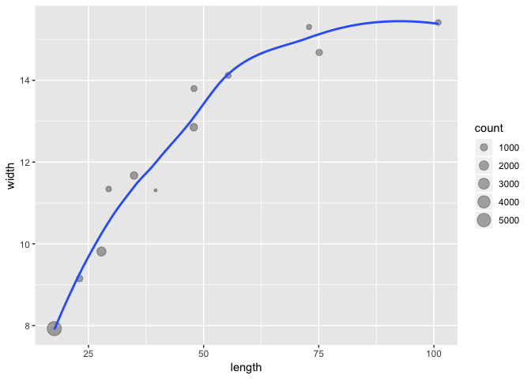

    library(dplyr)

    ## 
    ## Attaching package: 'dplyr'

    ## The following objects are masked from 'package:stats':
    ## 
    ##     filter, lag

    ## The following objects are masked from 'package:base':
    ## 
    ##     intersect, setdiff, setequal, union

    library(ggplot2)

    data = read.csv("WI2010data.csv")

    data %>% 
      group_by(FUNCTIONAL_CLASS_026) %>% 
      summarise(
        count = n(),
        length = mean(STRUCTURE_LEN_MT_049, na.rm = TRUE),
        width = mean(APPR_WIDTH_MT_032, na.rm = TRUE)
      ) %>% 
      ggplot(mapping = aes(x = length, y = width)) +
      geom_point(aes(size = count), alpha = 1/3) +
      geom_smooth(se = FALSE)

    ## `geom_smooth()` using method = 'loess' and formula 'y ~ x'

 I took a
look at the data for bridges in WI in 2010 because I’m interested in the
bridges located in the state that I’m currently living in. Also, I
picked Year 2010 because I would like to know how bridges were like in
WI a decade ago.

First, I grouped the dataset by funtional classes of bridges. Then, I
plotted the structural length of the bridges versus the approach roadway
width. Some interesting facts that I found out: 1. It’s obvious that
there are much more bridges with short length and short width than
longer and wider bridges. The point at the bottom left corner is much
larger than others and it corresponds to a specific type of bridge-local
rural raods (with code 9). This finding makes sense because local rural
bridges tend to be shorter and narrower. The longest and widest bridges’
fucntions are urban principle arterial interstate bridges (the point at
the top right corner, with code 11), which also makes sense because
bridges that intend to connect two places with further distances, such
as two states, need to be longer and wider. Thus, specific types of
bridges with specific functions tend to have specific length and width.
2. Grouping by the functional classes of bridges, there is an obvious
correlation between the length and width of the bridges. The longer the
bridge, the wider it is.
